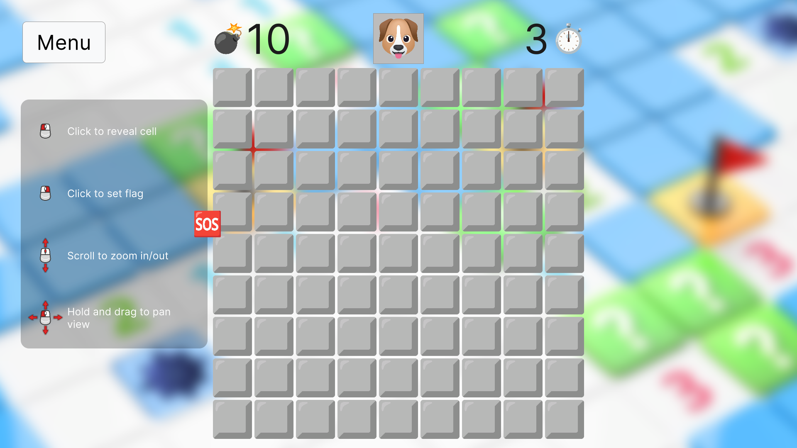
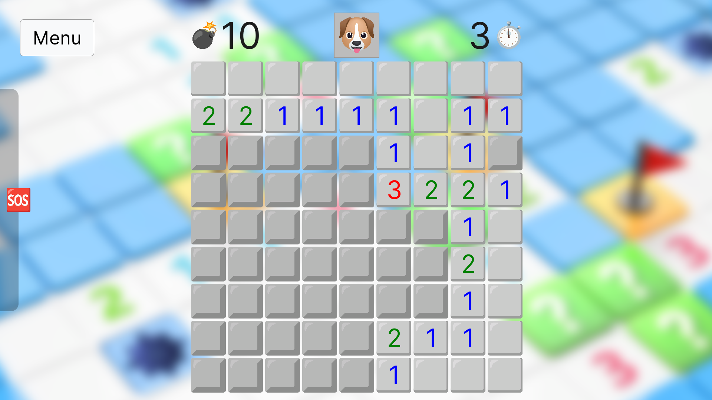
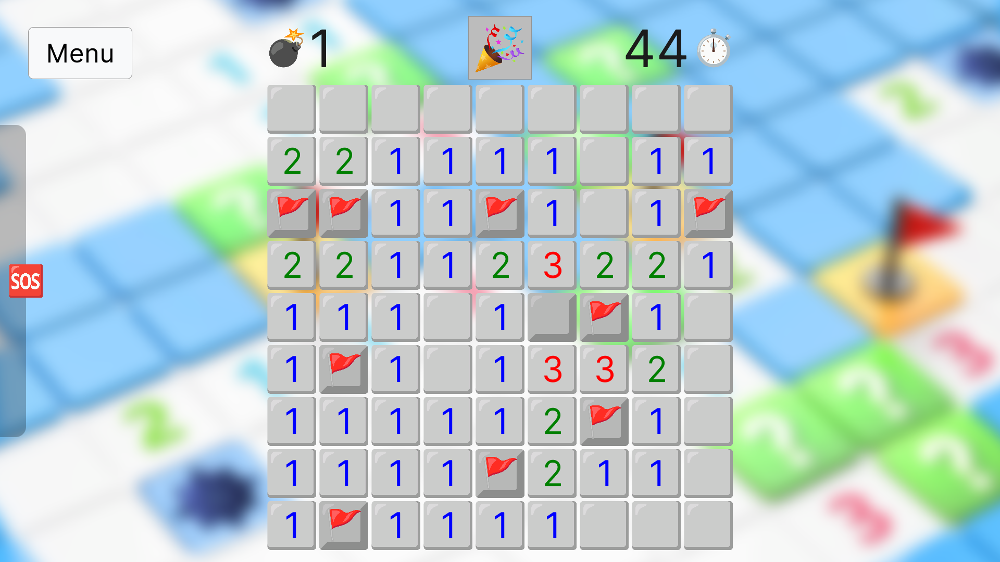
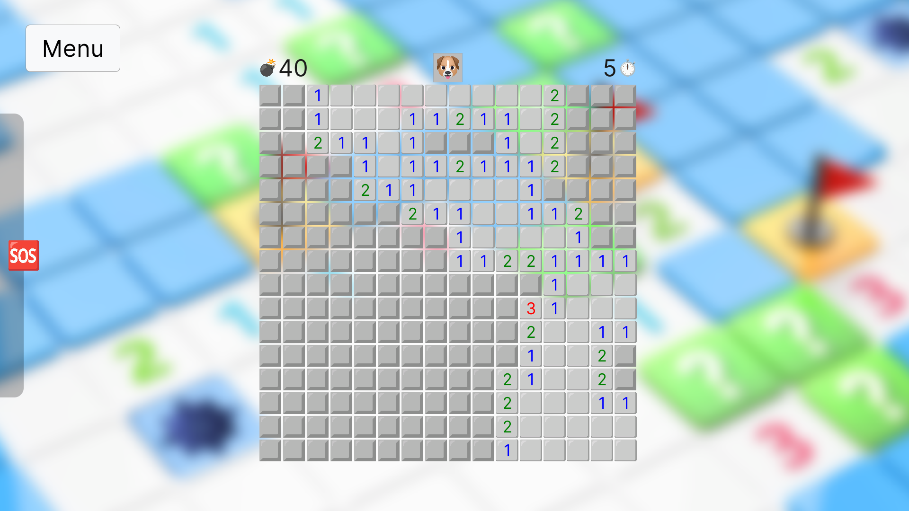
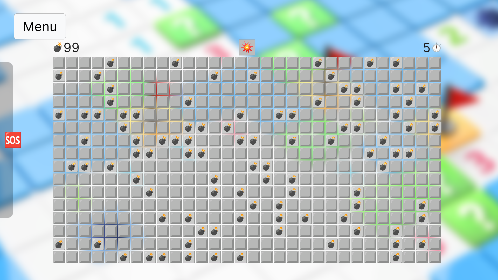

# unity-minesweeper

## Table of contents
- [Description](#description)
- [Screenshots](#screenshots)
- [Features](#features)
- [License](#license)

## Description

Made with **Unity Engine 2021.3.18f1**

Play online at https://dimapepino.itch.io/minesweeper

📢 **Description**

**Minesweeper** game with crazy idea — help the dog Patron all reveal bombs on the field 💣🚩

See that guy on the bottom side of the screen? Never trust him!

🕹️ **How to play**
- Click <kbd>LMB</kbd> (on square) — reveal cell
- Click <kbd>RMB</kbd> (on squre) — set/remove flag
- Scroll <kbd>Mouse Wheel</kbd> — zoom in/out
- Hold <kbd>LMB</kbd> and drag — pan view

🏭 **Development Team**
- Kukumberman (Dima Pepino) — idea, programming, art director   
- Arficord (Roman Chornyi) — Senior meme art engineer, help with Polish translation

⭐️ **Credits**
- Emoji art — **Google Noto Color Emoji** and **JoyPixels**
- [Xelu's FREE Controller Prompts](https://thoseawesomeguys.com/prompts/)

## Screenshots

Details

<table>
  <tr>
    <th colspan="2">
      
    </th>
  </tr>
  <tr>
    <td>
      
    </td>
    <td>
      
    </td>
  </tr>
  <tr>
    <td>
      
    </td>
    <td>
      
    </td>
  </tr>
  <tr>
    <th colspan="2">
      
    </th>
  </tr>
</table>

## Features

There are few branches with different stuff:
- [main](https://github.com/kukumberman/unity-minesweeper/tree/main)
  - Main purpose is to demonstrate how to structure architecture using [**Unity-Core-Template**](https://github.com/kukumberman/Unity-Core-Template)
  - If you want to build project in WebGL don't forget to remove scene **Scene Webgl Start** in **EditorBuildSettings** otherwise you would not be able to play game (I made it for [security](https://github.com/kukumberman/Unity-Webgl-Utils) reasons)
- [react-unity](https://github.com/kukumberman/unity-minesweeper/tree/react-unity)
  - Same game but was built using different approach using [**ReactUnity**](https://reactunity.github.io/)
  - Don't forget to install required dependencies (more at [README.md](https://github.com/kukumberman/unity-minesweeper/blob/react-unity/react/README.md))
  - Known issues
    - [Gameplay.tsx](https://github.com/kukumberman/unity-minesweeper/blob/react-unity/react/src/pages/Gameplay.tsx#L238) component is re-rendered each second
    - [Cell.tsx](https://github.com/kukumberman/unity-minesweeper/blob/react-unity/react/src/components/Gameplay/Cell.tsx) **onPointerUp** event is not properly handled, so it might fire on different element
    - mouse events are handled differently from main branch (at least hold <kbd>Middle Mouse Button</kbd> to pan view)
- [feature/shader-grid](https://github.com/kukumberman/unity-minesweeper/tree/feature/shader-grid)
  - Rendering entire grid in [shader](https://github.com/kukumberman/unity-minesweeper/blob/feature/shader-grid/Assets/Shaders/Shader%20MinesweeperGrid.shader)
  - How to play
    - Click <kbd>LMB</kbd> (on square) — reveal cell
    - Click <kbd>RMB</kbd> (on squre) — set/remove flag
    - Click <kbd>R</kbd> — restart

## License

This project is licensed under the MIT License, see [LICENSE.md](./LICENSE.md) for more information.
